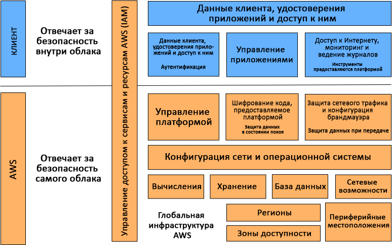
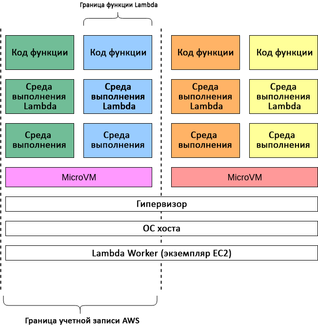
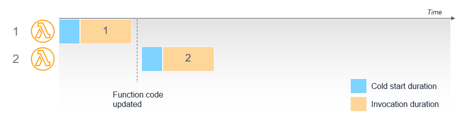
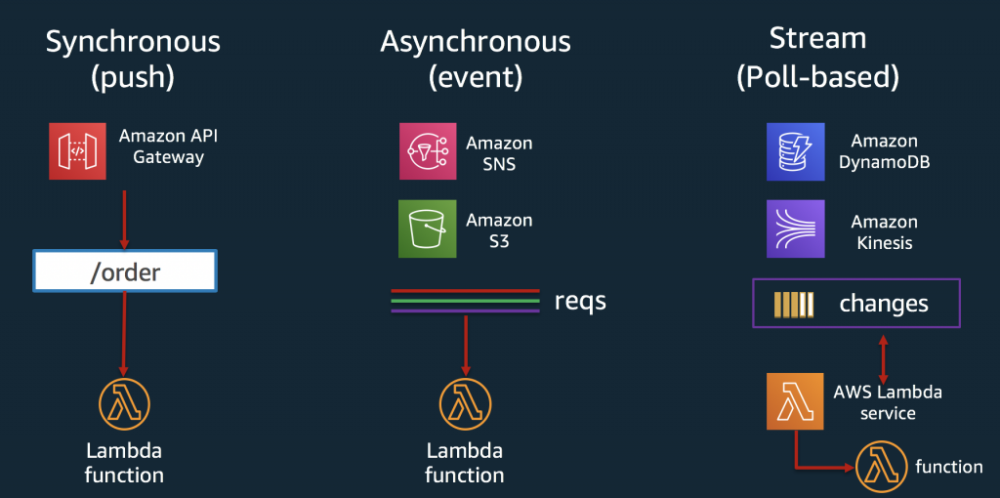
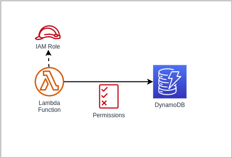
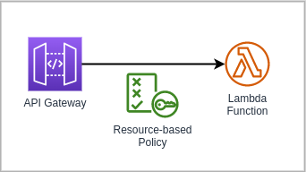
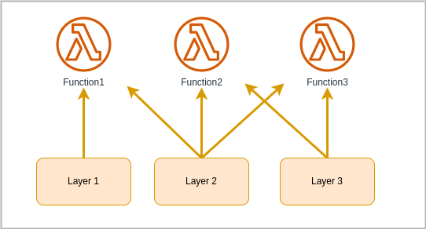
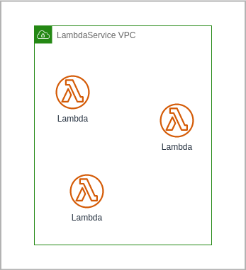
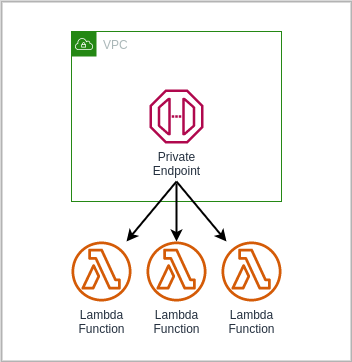

# AWS Lambda notes

## Serverless and FAAS

Безсерверные вычисления (англ. **serverless computing**) — стратегия организации платформенных облачных услуг, при которой облако автоматически и динамически управляет выделением вычислительных ресурсов в зависимости от пользовательской нагрузки. Основная задача такой стратегии — реализация шаблона «функция как услуга» (`FAAS`), при котором для выполнения каждого запроса (вызова функции) создаётся отдельный контейнер или виртуальная машина, уничтожающиеся после выполнения.

Таким образом провайдеры облачных услуг пытаются облегчить нам жизнь, мы не должны больше заботиться об инфраструктуре, масштабировании при нагрузке, обновлению системы и т.д., в целом говоря о хардварных вещах.

### Новый виток эволюции?


Звучит круто когда мы можем просто программировать а не заморачиваться инфраструктурой и прочими девопсовскими штучками, это позволяет нам писать бизнес логику и решать бизнес задачи, что уменьшает *time to market* - и это хорошо. Что же тогда `Serverless` это новый шаг в развитии веба? И да и нет. Да это новый и очень интересный подход но нельзя относится к нему как к панацее или волшебному швейцарскому ножу, это всего лишь еще один инструмент в руках разработчика. FAAS не призван заменить контейнеры. Кубер-бубер (Kubernetes) живее всех живых, контейнеры весьма сильный инструмент и сервера никуда не денутся, можно считать что FAAS как параллельное ответвление, и это круто ведь у нас появляется все больший функционал для решения поставленных задач.

## AWS Lambda

**AWS Lambda** – это безсерверный, управляемый событиями вычислительный сервис, который позволяет вам выполнять код практически для неограниченного типа приложения или сервиса без предоставления серверов и их обслуживания. Вы можете включить Lambda из более 200 сервисов и приложений, предоставляемых по модели ПО как услуга (SaaS), оплачивая только те ресурсы, которые используете.

### Применения

- Обработка файлов
    
- Потоковая обработка
    
- Интернет приложения
    
- Интернет вещей
    
- Внутренние службы для мобильных устройств
    
- ...

### Преимущества

Выше уже было упомянуто что AWS Lambda это FAAS (function as a service), тоесть мы не тратим усилия на поднятие и поддержание инфраструктуры, мы должны предоставить по сути только наш код (бизнес логику), платим только тогда когда наш код исполняется и все это счастье автоматически масштабируется.

Преимущества:

- **Деньги**. Вы платите только за то время, когда сервис работает.
- **Скорость**. Сама по себе лямбда поднимается и работает очень быстро.
- **Удобство**. Лямбда имеет много возможностей по интеграции с сервисами AWS.
- **Производительность**. Параллельно может выполняться, в зависимости от региона максимально от 500 до 3000 экземпляров. И при желании, этот лимит можно поднять, написав в поддержку.

Вот перечень ограничений для лямбды:

| Resource                                    | Quota                                                                       |
| ------------------------------------------- | --------------------------------------------------------------------------- |
| Function memory allocation                  | 128 MB to 10,240 MB                                                         |
| Function timeout                            | 900 seconds (15 minutes)                                                    |
| Function environment variables              | 4 KB, for all environment variables associated with the function            |
| Function resource-based policy              | 20 KB                                                                       |
| Function layers                             | five layers                                                                 |
| Function burst concurrency                  | 500 - 3000 (varies per Region)                                              |
| Invocation payload (request and response)   | 6 MB (synchronous), 256 KB (asynchronous)                                   |
| Deployment package (.zip file archive) size | 50 MB (zipped, for direct upload), 250 MB (unzipped), 3 MB (console editor) |
| Container image code package size           | 10 GB                                                                       |

### Сразу к коду

Предлагаю долго не раздумывать и посмотреть как выглядит код лямбда функции, я не буду рассматривать создание функции, лишь частично затрону эту тему.

Вот так выглядит код простейшей лямбды:

```Python
    def handler(event, context):
        print("First lambda")
        return "Hello world"
```

По сути это просто функция которая принимает `event` и `context`. `Event` - это данные которые мы передаем в нашу лямбду, по сути это просто json, он в целом может быть любым, но каждый сервис генерирует `event` в определенном формате, вот так например выглядит `event` с `S3`:

```json
{
  "Records": [
    {
      "eventVersion": "2.0",
      "eventSource": "aws:s3",
      "awsRegion": "us-east-1",
      "eventTime": "1970-01-01T00:00:00.000Z",
      "eventName": "ObjectCreated:Put",
      "userIdentity": {
        "principalId": "EXAMPLE"
      },
      "requestParameters": {
        "sourceIPAddress": "127.0.0.1"
      },
      "responseElements": {
        "x-amz-request-id": "EXAMPLE123456789",
        "x-amz-id-2": "EXAMPLE123/5678abcdefghijklambdaisawesome/mnopqrstuvwxyzABCDEFGH"
      },
      "s3": {
        "s3SchemaVersion": "1.0",
        "configurationId": "testConfigRule",
        "bucket": {
          "name": "example-bucket",
          "ownerIdentity": {
            "principalId": "EXAMPLE"
          },
          "arn": "arn:aws:s3:::example-bucket"
        },
        "object": {
          "key": "test/key",
          "size": 1024,
          "eTag": "0123456789abcdef0123456789abcdef",
          "sequencer": "0A1B2C3D4E5F678901"
        }
      }
    }
  ]
}
```

`Context` - это json объект содержащий информацию о вызове, функции и среде выполнения.

При желании обработчик может вернуть значение. Что происходит с возвращаемым значением, зависит от типа вызова и службы, вызвавшей функцию. Например:

- Если вы используете тип вызова RequestResponse, например синхронный вызов, AWS Lambda возвращает результат вызова функции Python клиенту, вызывающему функцию. Например, консоль AWS Lambda использует тип вызова RequestResponse, поэтому, когда вы вызываете функцию на консоли, консоль отображает возвращаемое значение.

- Если обработчик возвращает объекты, которые нельзя сериализовать с помощью json.dumps, среда выполнения возвращает ошибку.

- Если обработчик возвращает None, как это неявно делают функции Python без оператора return, среда выполнения возвращает null.

- Если лямбда вызывается асинхронно (будет рассмотрено далее) то возвращаемое значение не имеет роли, значение отбрасывается.

### Security

Как и большинство сервисов AWS, Lambda предоставляется по принципу общей ответственности AWS и клиента по части безопасности и соблюдения нормативных требований. Этот принцип снижает операционную нагрузку на клиента, поскольку AWS берет на себя задачи обслуживания, администрирования и контроля компонентов сервиса — от операционной системы хоста и уровня виртуализации до физической безопасности объектов инфраструктуры.

Если говорить конкретно об AWS Lambda, то AWS отвечает за управление нижележащей инфраструктурой, связанными базовыми сервисами, операционной системой и платформой приложений. В то время как клиент несет ответственность за безопасность своего кода, хранение конфиденциальных данных, контроль доступа к ним, а также к сервису и ресурсам Lambda (Identity and Access Management, IAM), в том числе в пределах используемых функций.



---

### Анатомия лямбда функции

Основное преимущество Lambda заключается в том, что, выполняя функцию от вашего имени, сервис сам выделяет необходимые ресурсы, тут необходимо уточнить что мы можем настроить сколько оперативной памяти выделить лямбде и от этого будет зависеть сколько процессорных ресурсов ей будет выделено, но об этом немного позже. Вы можете не тратить время и силы на администрирование систем и сосредоточиться на бизнес-логике и написании кода.

Каждая функция работает в одной или нескольких выделенных средах, которые существуют лишь в течение жизненного цикла этой функции, а затем уничтожаются. В каждой среде одновременно выполняется лишь один вызов, но она используется повторно, если возникает множество серийных вызовов одной и той же функции. Все среды выполнения работают на виртуальных машинах с аппаратной виртуализацией — на так называемых microVM. Каждая microVM назначается конкретной учетной записи AWS и может многократно использоваться средами для выполнения различных функций в этой учетной записи. MicroVM упаковываются в структурные блоки аппаратной платформы Lambda Worker, которой владеет и управляет AWS. Одна и та же среда выполнения не может использоваться разными функциями, равно как microVM уникальны для разных учетных записей AWS.



При создании среды выполнения загружается ваш код и слои и подготавливается программа которая запустит ваш код (интерпретатор питона). Также в среде выполнения создается файловая система по пути /tmp размером 512 MB где можно хранить какие-то файлы, кеш и т.д. Она будет существовать пока будет существовать окружение, таким образом можно сохранять (кешировать) какую-то информацию между вызовами лямбда функций.


Также у лямбда функции есть переменные окружения в которых мы можем хранить какие-то настройки или секреты.

---

### Execution Environment

Lambda вызывает вашу функцию в среде выполнения, которая обеспечивает безопасную и изолированную среду выполнения для вашего кода. Среда выполнения управляет ресурсами, необходимыми для выполнения вашей функции. Среда выполнения также обеспечивает поддержку жизненного цикла для среды выполнения функции и любых внешних расширений, связанных с вашей функцией.

Среда выполнения функции взаимодействует с Lambda с помощью API среды выполнения. Расширения взаимодействуют с Lambda с помощью Extensions API. Расширения также могут получать сообщения журнала от функции, подписавшись на логи с помощью Logs API.


Когда вы создаете свою функцию Lambda, вы указываете информацию о конфигурации, такую ​​как объем доступной памяти и максимальное время выполнения, разрешения для вашей функции. Lambda использует эту информацию для настройки среды выполнения.

Среда выполнения функции и каждое внешнее расширение — это процессы, работающие в среде выполнения. Разрешения, ресурсы, учетные данные и переменные среды совместно используются функцией и расширениями.

---

### Life cycle

Жизненный цикл среды выполнения включает следующие этапы:

- **Init**: на этом этапе Lambda создает или размораживает среду выполнения с настроенными ресурсами, загружает код для функции и всех слоев, инициализирует все расширения, инициализирует среду выполнения, а затем запускает код инициализации функции (код вне основного обработчика). Фаза Init происходит либо во время первого вызова, либо перед вызовами функций, если вы включили подготовленный параллелизм. Фаза инициализации разделена на три подэтапа: `инициализация расширения`, `инициализация среды выполнения` и `инициализация функции`. Эти подэтапы гарантируют, что все расширения и среда выполнения завершат свои задачи установки до того, как запустится код функции.

- **Invoke**: на этом этапе Lambda вызывает обработчик функции. После завершения функции Lambda готовится к вызову другой функции.

- **Shutdown**: эта фаза запускается, если функция Lambda не получает никаких вызовов в течение определенного периода времени (15 минут). На этапе Shutdown Lambda останавливает среду выполнения, предупреждает расширения, чтобы позволить им завершить работу без ошибок, а затем удаляет среду. Lambda отправляет событие Shutdown каждому расширению, которое сообщает расширению, что среда будет отключена.


Каждая фаза начинается с события, которое Lambda отправляет среде выполнения и всем зарегистрированным расширениям. Среда выполнения и каждое расширение указывают на завершение, отправляя запрос Next API. Lambda замораживает среду выполнения, когда среда выполнения и каждое расширение завершены и нет ожидающих событий. При получения события, если есть замороженная среда выполнения, то Lambda размораживает эту среду, таким образом не тратиться время на фазу инициализации.

#### Init phase

На этапе инициализации Lambda выполняет три задачи:

- Запустить все расширения (`Extension init`)
- Собрать среду выполнения (`Runtime init`)
- Запустить статический код функции (`Function init`)

Фаза Init заканчивается, когда среда выполнения и все расширения сообщают о своей готовности, отправляя запрос Next API. Фаза инициализации ограничена 10 секундами. Если все три задачи не выполняются в течение 10 секунд, Lambda повторяет фазу Init во время первого вызова функции.

#### Invoke phase

Когда Lambda функция вызывается в ответ на запрос Next API, Lambda отправляет событие Invoke среде выполнения и каждому расширению.

Настройка тайм-аута функции ограничивает продолжительность всей фазы Invoke. Например, если вы установите время ожидания функции на 360 секунд, функция и все расширения должны завершиться в течение 360 секунд. Обратите внимание, что не существует независимой фазы пост-вызова. Продолжительность представляет собой сумму всего времени вызова (время выполнения функции + время работы расширения) и не рассчитывается до тех пор, пока функция и все расширения не закончат выполнение.

Фаза вызова завершается после того, как среда выполнения и все расширения сигнализируют об этом, отправляя запрос Next API.

Если функция Lambda дает сбой или истекает время ожидания на этапе вызова, Lambda сбрасывает среду выполнения. Сброс ведет себя как событие Shutdown. Во-первых, Lambda закрывает среду выполнения. Затем Lambda отправляет событие Shutdown на каждое зарегистрированное внешнее расширение. Событие включает причину выключения. Если другое событие Invoke приводит к повторному использованию этой среды выполнения, Lambda инициализирует среду выполнения и расширения как часть следующего вызова.


#### Shutdown phase

Когда Lambda собирается завершить работу среды выполнения, она отправляет событие Shutdown среде выполнения и каждому внешнему расширению. Расширения могут использовать это время для окончательной очистки. Событие Shutdown — это ответ на запрос Next API.

Продолжительность: вся фаза выключения ограничена 2 секундами. Если среда выполнения или какое-либо расширение не отвечает, Lambda завершает его с помощью сигнала (SIGKILL).

После завершения функции и всех расширений Lambda некоторое время поддерживает среду выполнения в ожидании вызова другой функции. По сути, Lambda замораживает среду выполнения. Когда функция вызывается снова, Lambda размораживает среду для повторного использования. Повторное использование среды выполнения имеет следующие последствия:

- Объекты, объявленные вне метода обработчика функции, остаются инициализированными, обеспечивая дополнительную оптимизацию при повторном вызове функции. Например, если ваша функция Lambda устанавливает соединение с базой данных, вместо повторного установления соединения в последующих вызовах используется исходное соединение. Мы рекомендуем добавить логику в ваш код, чтобы проверить, существует ли подключение, прежде чем создавать новое.

- Каждая среда выполнения предоставляет от 512 МБ до 10 240 МБ с шагом 1 МБ. дискового пространства в каталоге /tmp. Содержимое каталога остается, когда среда выполнения заморожена, обеспечивая временный кэш, который можно использовать для нескольких вызовов. Вы можете добавить дополнительный код, чтобы проверить, есть ли в кеше данные, которые вы сохранили. Дополнительные сведения об ограничениях размера развертывания см. в разделе Квоты Lambda.

- Фоновые процессы или обратные вызовы, которые были инициированы вашей функцией Lambda и не завершились, когда функция завершилась, возобновляются, если Lambda повторно использует среду выполнения. Перед завершением кода убедитесь, что все фоновые процессы или обратные вызовы в вашем коде завершены.

Когда вы пишете свой код функции, не думайте, что Lambda автоматически повторно использует среду выполнения для последующих вызовов функций. Другие факторы могут диктовать необходимость Lambda для создания новой среды выполнения, что может привести к неожиданным результатам, таким как сбои подключения к базе данных.

### More about Cold/Warm start

Мы уже знаем что при первом запуске лямбды нам необходимо время для того что бы подготовить окружение для выполнения лямбды это называется `cold start`, но при последующих выполнениях будет переиспользовать готовое окружение, это `warm start`.

Есть часть холодного старта на которую мы не можем повлиять, так как это зависит от инфраструктуры AWS, но есть часть которую мы можем оптимизировать.


Какие-то соединения или другие ресурсы которые требует много времени на создание лучше устанавливать вне контекста функции, а глобально, чтобы переиспользовать эти объекты при повторных вызовах лямбды.

```python
import boto3

# Мы создаем клиент SQS глобально
# значит он создастся в фазе Init 
# и не исчезнет после того как функция завершиться
client = boto3.client('sqs')

def handler(event, context)
    # some code
    # в самой функции мы не тратим время для инициализации соединения с sqs
    response = client.send_message("some payload here")

```

При обновлении конфигурации или обновлении кода, старое окружение останавливается, и при выполнении лямбда функции будет создано новое окружение с новой конфигурацией.



Lambda автоматически масштабируется при нагрузке поэтому когда нам приходит несколько запросов одновременно Lambda создает новые окружения для выполнения лямбда функций, которые могут потом быть переиспользовать когда функция закончит свое выполнение. Lambda функция может переиспользовать только окружения созданные такой же Lambda функцией. Если у нас есть например Lambda foo1 и foo2 то после выполнения foo1 ее окружение останется, но foo2 не сможет его использовать поскольку это другая функция.


Для асинхронных вызовов между вызывающей стороной и службой Lambda существует внутренняя очередь. Lambda максимально быстро обрабатывает сообщения из этой очереди и автоматически масштабируется по мере необходимости. Если функция использует `reserved concurrency`, это действует как максимальная емкость, поэтому внутренняя очередь сохраняет сообщения до тех пор, пока функция не сможет их обработать.

Например, S3 bucket настроен на вызов функции Lambda, когда объекты записываются в него:


Если зарезервированная емкость функции Lambda установлена равной 1 и 6 объектов записываются в bucket одновременно, события обрабатываются последовательно одной средой выполнения. Ожидающие события сохраняются во внутренней очереди.


Мы можем воспользоваться `provisioned concurrency` для того чтобы поддерживать определенное количество лямбд в разогретом состоянии, тем самым уменьшив задержку при их вызове.


---

### Event, Push, Pull Model

Для того чтобы лямбда сработала ее кто-то должен вызвать, в aws довольно много сервисов которые интегрированы с лямбдой, и могут ее вызывать. Можно разделить типы вызовов лямбды на три категории: `Push`, `Pull`, `Event`.



#### Push (Synchronous)

Push или Synchronous модель выполнения лямбды, это модель при которой мы непосредственно вызываем лямбду и ждем пока она выполниться что бы получить ответ. Так работает например API Gateway, при запросе на эндпоинт вызывается лямбда функция в которую передается нужная информация для обработки запроса, и API Gateway ожидает пока лямбда выполниться, вернет ответ и ответ вернется клиенту, или лямбда упадет - тогда API Gateway вернет код ошибки 502.

#### Event (Asynchronous)

При Event или Asynchronous модели, сервис который генерирует событие никак не обрабатывает результат выполнения лямбда функции, поэтому он просто генерирует событие которое должно обработаться лямбда функцией и все. Как пример это S3 Bucket. При добавлении нового файла например S3 может сгенерировать событие которое вызовет лямбда функцию, лямбда функция в свою очередь сможет получить идентификатор файла, достать его с S3, что-то с ним сделать, но это все будет уже вне контекста ивента с S3, S3 свое дело уже сделал сгенерировав событие (event). За счет того что мы не должны вернуть ответ сервису который сгенерировал ивент, мы должны как-то обрабатывать ситуации когда наша функция отработает с ошибкой. При асинхронном вызове если функция отработает с ошибкой то Lambda попытается запустить функцию заново еще два раза, и если функция все так же будет падать с ошибкой то можно отправить ивент который вызвал функцию в `DeadLetterQueue` если такова настроена.
Так же при асинхронном вызове можно указать для лямбды `Destination`, т.е. мы можем указать куда перенаправить результат выполнения функции при успешном выполнении или при ошибке.


#### Pull (Poll-based)

При Pull модели сервис не может вызвать лямбду напрямую. Возьмем например SQS. SQS не генерирует никакого ивента когда сообщение попадает в очередь, поэтому нужно как-то следить за тем есть ли у нас новые сообщения в нашей очереди, и это делает Lambda Service. По сути Lambda Service с некой периодичностью опрашивает SQS что бы узнать нет ли новых сообщений, и если они там есть, то вызывает уже непосредственно нашу лямбду для обработки этих сообщений.

---

### Triggers and permissions

#### Execution permission

Функция Lambda имеет политику, называемую `execution role`, которая предоставляет ей разрешение на доступ к сервисам и ресурсам AWS. Как минимум вашей функции необходим доступ к журналам Amazon CloudWatch для потоковой передачи логов. Если вы используете AWS X-Ray для отслеживания своей функции или ваша функция обращается к сервисам с помощью AWS SDK, вы предоставляете ей разрешение используя `execution role`. Lambda также использует роль выполнения для получения разрешения на чтение из источников событий, когда вы используете сопоставление источников событий для запуска вашей функции.



Хорошей практикой является выделять как можно меньше прав для ваших ресурсов, если лямбде нужно только отправлять сообщения в SQS то нужно выдать ей разрешение только на отправку сообщений в определенную очередь SQS, или например дать разрешение только читать из определенной базы в DynamoDB.

#### Resource-based policies

Используйте `resource-based policies`, чтобы разрешить другим аккаунтам и сервисам AWS использовать ваши ресурсы Lambda. Ресурсы Lambda включают функции, версии, псевдонимы и версии слоев. Каждый из этих ресурсов имеет политику разрешений, которая применяется при доступе к ресурсу, в дополнение к любым политикам, которые применяются к пользователю. Когда сервис AWS, такой как Amazon S3, вызывает вашу функцию Lambda, `resource-based policies` предоставляет ей доступ.



---

### Scaling

#### Concurrency

**Concurrency** (параллелизм) — это количество активных экземпляров вашей функции. Lambda предоставляет два типа управления параллелизмом: *Reserved concurrency* (зарезервированный параллелизм) и *provisioned concurrency* (подготовленный параллелизм).

Параллельное выполнение лямбд имеет некоторые ограничения:

1. Concurrency limit - ограничение на максимальное количество параллельно выполняющихся экземпляров функции для аккаунта.
2. Burst limit - это лимит после которого создание новых экземпляров будет происходить линейно.

После первоначального всплеска создания лямбд, когда количество лямбд достигнет `burst limit`, количество функций может увеличиваться на дополнительные 500 экземпляров каждую минуту. Это продолжается до тех пор, пока не будет достаточно экземпляров для обслуживания всех запросов или пока не будет достигнут `concurrency limit`. Когда запросы поступают быстрее, чем ваша функция может масштабироваться, или когда ваша функция находится на максимальном параллелизме, дополнительные запросы завершаются с ошибкой регулирования (код состояния 429).

В следующем примере показана функция, обрабатывающая всплеск трафика. По мере экспоненциального увеличения количества вызовов функция увеличивается. Он инициализирует новый экземпляр для любого запроса, который не может быть перенаправлен на доступный экземпляр. Когда достигается предел параллельного выполнения пакета, функция начинает масштабироваться линейно. Если этого параллелизма недостаточно для обслуживания всех запросов, дополнительные запросы регулируются, и их следует повторить.


#### Reserved concurrency

Lambda может выделять необходимые ресурсы и запускать новые окружения по мере необходимости, но нам необходимо это как-то контролировать, поскольку может случиться что лямбда будет поднимать новые окружения бесконечно, по дефолту есть ограничение на параллельное выполнение лямбд (активных окружений) на аккаунт, в зависимости от региона эта цифра варьируется от 500 до 3000 и можно обратиться в поддержку для увеличения предела. Это ограничение действует на все лямбда функции в аккаунте, т.е. не важно какие и сколько лямбд сейчас активны их суммарное количество не должно превышать некого предела. Но для того что-бы контролировать максимальное количество параллельных выполнений отдельной лямбды существует `reserved concurrency` - по сути это предел который указывает сколько лямбд конкретного типа может выполняться параллельно, дело в том что `reserved concurrency` по сути резервирует количество мест из общего лимита на аккаунт и не может превышать число = `лимит на аккаунт - константа`, это нужно чтоб всегда оставался свободный лимит для выполнения других лямбд.

Допустим наш лимит на аккаунт это 10 параллельных выполнений, и у нас есть 3 функции `dev`, `prod` и `other`. Мы указали для `dev` функции `reserved concurrency` = 4, для `prod` тоже = 4. Тогда в любой момент времени у нас может выполняться до 4 экземпляров функции `dev` и до 4 экземпляров функции `prod`, если уже существует 4 выполняющиеся функции то 5 создана уже не будет. Но `reserved concurrency` откусывает кусок от общего пула, поэтому в любой момент времени функция `other` и другие функции которые мы можем создать в сумме могут иметь максимум 2 параллельно выполняющихся экземпляра, даже если `dev` и `prod` в это время не выполняются.


#### Provisioned concurrency

Когда ваша функция масштабируется, на первый запрос, обслуживаемый каждым экземпляром, влияет время, необходимое для загрузки и инициализации вашего кода (`cold start`). Если ваш код инициализации занимает много времени, влияние на среднюю и процентильи задержку может быть значительным. Чтобы ваша функция могла масштабироваться без задержки, используйте `provisioned concurrency`подготовленный параллелизм. В следующем примере показана функция с подготовленным параллелизмом, обрабатывающая всплеск трафика.


Можно пойти еще дальше и создать autoscaling группу для лямбда функции, которая будет отслеживать метрики и при преодолении некого порога создавать дополнительные разогретые окружения.


Есть также альтернативные методы разогрева лямбда функций, когда по CloudWatch Event который генерируется с определенным промежутком запускается лямбда функция которая запускает другие лямбды для их разогрева. Можно глянуть [тут](https://github.com/jeremydaly/lambda-warmer) и [тут](https://github.com/robhowley/lambda-warmer-py)

---

### Layers

Самый распространенный способ предоставления кода для функции это запаковать код с зависимостями в архив и загрузить это на S3. Но порой несколько лямбда функций используют одну и ту же логику или одни и те же зависимости, тогда что-бы не повторять наш код по всем функциям мы можем вынести общую логику в `Lambda Layer`. Несколько лямбд могут использовать общий слой. При сборке окружения будет загружаться архив с кодом и отдельно архив со слоем, вместе распакованный код не должен занимать более 250 MB.



Из следующего примера мы видим что у нас есть некая бизнес логика, наша функция обработчик и какие-то helper функции. Лучше всего handler функцию оставлять как можно более краткой, логику выносить в отдельные функции или модули и хранить этот код в лямбда функции, а helper функции вынести в `Layer` и подключить этот `Layer` к другим лямбдам которым тоже нужны эти функции

```python

# initialization that will be executed in Init phase___________>
import boto3

client = pre_handler_db_connection()

#______________________________________________________________<


# Lambda handler function______________________________________>
def handler(event, context):
  do_logic()
  return {

  }
#______________________________________________________________<


# some business logic__________________________________________>
def do_logic():
  secret = get_secret()
  # do something

#______________________________________________________________<


# some utility functions shared across different lambdas_______>
def get_secret():
  # get secret from secret store
  pass

def pre_handler_db_connection():
  # connecting to db
  pass

#______________________________________________________________<
```

---

### Versioning

Вы можете использовать версии для управления развертыванием ваших функций. Например, вы можете опубликовать новую версию функции для бета-тестирования, не затрагивая пользователей стабильной рабочей версии. Lambda создает новую версию вашей функции каждый раз, когда вы публикуете функцию. Новая версия является копией неопубликованной версии функции.

>Lambda не создает новую версию, если код в неопубликованной версии такой же, как и в предыдущей опубликованной версии. Вам необходимо развернуть изменения кода в $LATEST, прежде чем вы сможете создать новую версию.

Версия функции включает в себя следующую информацию:

- Код функции и все связанные зависимости.

- Среда выполнения Lambda, которая вызывает функцию.

- Все настройки функции, включая переменные окружения.

- Уникальное имя ресурса Amazon (ARN) для идентификации конкретной версии функции.

Вы можете ссылаться на свою лямбда-функцию, используя квалифицированный ARN или неквалифицированный ARN.

- Qualified ARN ARN — функциональный ARN с суффиксом версии. Следующий пример относится к версии 42 функции helloworld
  `arn:aws:лямбда:aws-регион:acct-id:функция:helloworld:42`

- Unqualified ARN — функция ARN без суффикса версии.
  `arn:aws:лямбда:aws-регион:acct-id:функция:helloworld`

> Вы можете использовать квалифицированный или неквалифицированный ARN во всех соответствующих операциях API. Однако вы не можете использовать неквалифицированный ARN для создания псевдонима.

#### Alias

Вы можете создать один или несколько псевдонимов (`Alias`) для вашей лямбда-функции. Псевдоним Lambda подобен указателю на конкретную версию функции. Пользователи могут получить доступ к версии функции, используя псевдоним Amazon Resource Name (ARN).

И так, теперь давайте разберемся что нужно сделать, чтобы получить то — что мы видим на диаграмме

- Состояние первое

  - Создать первую версию нашей лямбды. Вместе с первой версией у нас создается указатель на версию **`$LATEST`**. Он всегда указывает на последнюю добавленную версию
  - Добавить алиас **`Dev`**. Тут мы выбираем куда привязать, у нас есть несколько вариантов — создать указатель на конкретный номер версии, в нашем случае **1**, привязать указатель к **`$LATEST`**, или привязать к другому алиасу. В данном случае мы прикрепляем к указателю **`$LATEST`**, и теперь наш **`Dev`** алиас всегда будет указывать на последнюю ветку, так мы можем всегда на дев окружении тестировать наше приложение с последней версией лямбды. И если вдруг нам понадобится проверить, как оно работает на старой версии, нужно будет просто переключить в триггере алиас или изменить у алиаса ссылку на версию, не трогая наше приложение
  - Добавить алиас **`Stage`** и привязать его к первой версии нашей лямбды
  - Добавить алиас **`Prod`** и повторить, что мы делали для **`Stage`**

  И так, сейчас мы получили что-то непонятное, по сути 3 алиаса ссылаются на одну версию, непонятно. Но ничего, все по порядку

- Второе состояние

  - Создать вторую версию нашей лямбды(Возможно добавить второй вывод «Hello world»). Тут хочу отметить, что в этот момент **`$LATEST`** будет смотреть сразу на вторую версию. И так как «Dev» привязан к **`$LATEST`**, то он тоже будет смотреть на вторую версию.
  - Далее, мы хотим чтобы наш **`Stage`** смотрел на вторую версию. Сейчас он привязан к версии **1**. Тут нам нужно вручную поменять версию на которую указывает **`Stage`**.
  - Радуемся. Мы получили то — что видим как второе состояние на графике. То есть, наш **`Prod`** смотрит на первую версию, а **`Dev`** и **`Stage`** на вторую.

- Третье состояние

  Теперь, чтобы получить третье состояние, нам достаточно просто добавить еще пару строк в наш код и будет третья версия нашей лямбды. И **`Dev`** будет смотреть теперь на нее.

---

### Networking

#### Basic concepts

Region - это географический регион в котором расположены сервера. Внутри регионов есть так называемые `Availability Zone` - это отдельные датацентры. Желательно дублировать свои ресурсы в нескольких `AZ` чтобы при какой-то поломке ваш продукт продолжил нормально работать.
VPC - это Virtual Private Cloud, некая сеть которая изолирована и защищена от внешнего мира и привязана к вашему аккаунту. VPC можно разбить на еще более мелкие подсети `Subnets`, в которых можно располагать свои ресурсы, по сути это просто группа ip адресов с связанным `Route Table`. `Route Table` это правила как и куда направлять трафик. Для того чтобы ресурсы могли общаться с внешним миром им нужен один из gateway, в данном случае `Internet Gateway`, который позволяет проходить трафику в обоих направлениях, инициировать передачу данных может как сам ресурс, так и кто-то из вне может стучаться на этот ресурс, но к `InternetGateway` можно подключить только ресурсы имеющие публичный ip. Что если мы хотим только одностороннее движение трафика, тогда нужно использовать NAT-Gateway, он позволяет подключать ресурсы без публичных ip адресов, и инициировать соединение может только ресурс, а не кто-то из вне. Тут нужно рассмотреть немного что такое `PrivateSubnet` и `PublicSubnet`, по сути `PublicSubnet` имеет такой `RouteTable` который перенаправляет трафик на `InternetGateway`, а `PrivateSubnet` такого правила в таблице адресов не имеет. Много aws сервисов по типу DynamoDB, SQS и прочего взаимодействуют через API, это значит что наш ресурс должен отправить некий запрос через интернет, и тут возникает трудность когда у нас ресурс находиться в приватной подсети, мы можем настроить `NAT Gateway`, но есть решение лучше, и это `VPC Endpoint`. `VPC Endpoint` позволяет подключаться из приватной подсети к сервисам aws, и трафик не выходит наружу в интернет.


#### LambdaService VPC

С основами вроде все ясно, но `Lambda` вроде как сервис aws который должен упростить деплой и масштабирование, и как же лямбды работают с `VPC`. Ну все лямбда функции развертываются в отдельном `VPC` которым управляет `AWS Lambda` сервис.



#### Connect Lambda to VPC

Если мы используем сервисы вроде `DynamoDB` или подобные то вопросов нет, необходимо только выделить нужные права, но что если у нас есть `RDS` расположенная внутри нашего `VPC`, для этого необходимо подключить лямбда функцию к нашему `VPC`. При подключении лямбда функции к `VPC`, в `VPC` создается `ENI (ElasticNewtorkInterface)`, ему выделяется приватный ip из пула адресов подсети и лямбда функция подключается к этому `ENI` через `V2N (VPC to VPC NAT)`, `V2N` это сервис который отвечает за создание и масштабирование `ENI`. Весь исходящий трафик лямбды будет теперь идти через этот `ENI` кроме логов, данные в `CloudWatch` будут уходить напрямую.


При такой конфигурации лямбда не сможет подключиться к другим сервисам aws поскольку трафик идет через `ENI` в `PrivateSubnet`, поэтому нужно добавить либо `NAT Gateway` либо `VPC Endpoint`.

#### Private Routes

Если мы хотим создать приватный API для вызова лямбда функций то мы можем воспользоваться `API Gateway` и создать приватные эндпоинты. Доступ к приватным эндпоинтам можно получить только из `VPC`, при этом лямбда функцию не нужно привязывать к `VPC`, нужно только если лямбда должна обращаться к каким-то ресурсам находящимся в `VPC`.



---

### Lambda Optimization

Мы можем конфигурировать нашу лямбда функцию выбирать архитектуру на которая она будет выполняться. Устанавливать `timeout` для лямбда функции по истечению которого функция закончится с ошибкой. Таймаут желательно брать на 30% больше чем предположительное время выполнения самой функции (это топорный подход подбора мощности блока питания который я унаследовал из электроники), максимально возможный `timeout` = 15 минутам, если ваш процесс занимает больше времени то лямбда функция возможно не для вас, или стоит подумать как его разбить на несколько этапов.

Также еще ондой важной настройкой является выделяемая оперативная память, можно выделить от 128 MB до 10 GB, пропорционально тому сколько памяти выделяется лямбде ей выделяется и процессорной мощности, и это очень важно, так как размер платы зависит от времени которое было потрачено на выполнение функции (инициализация окружения не считается) и от того сколько памяти ей было выделено. Это важно помнить и понимать, поскольку иногда увеличение памяти может значительно уменьшить время выполнения, таким образом можно выиграть и на ускорении и на оплате.

|Memory|Duration|Cost|
|---|---|---|
|128 MB|11.722 s|$0.024628|
|256 MB|6.678 s|$0.028035|
|512 MB|3.194 s|$0.026830|
1024 MB|1.465 s|$0.024638|

Для того чтобы подобрать оптимальный вариант для своего сценария (понять что вам нужнее скорость выполнения или цена, а возможно "золотая середина") существует инструмент [AWS Lambda Power Tuning](https://github.com/alexcasalboni/aws-lambda-power-tuning).


## Resources

Docs:

- [AWS Lambda Developer Guide](https://docs.aws.amazon.com/lambda/latest/dg/welcome.html)
- [AWS Lambda Operator Guide](https://docs.aws.amazon.com/lambda/latest/operatorguide/intro.html)
- [Lambda Security Overview](https://pages.awscloud.com/rs/112-TZM-766/images/Overview-AWS-Lambda-Security.pdf)

Articles:

- [Lambda destinations](https://aws.amazon.com/blogs/compute/introducing-aws-lambda-destinations/)

- [Difference between Internet Gateway and NAT Gateway](https://medium.com/awesome-cloud/aws-vpc-difference-between-internet-gateway-and-nat-gateway-c9177e710af6)

- [Performance optimization – Part 1](https://aws.amazon.com/blogs/compute/operating-lambda-performance-optimization-part-1/)
- [Performance optimization – Part 2](https://aws.amazon.com/blogs/compute/operating-lambda-performance-optimization-part-2/)
- [Performance optimization – Part 3](https://aws.amazon.com/blogs/compute/operating-lambda-performance-optimization-part-3/)

- [VPC RouteTables](https://medium.com/awesome-cloud/aws-vpc-route-table-overview-intro-getting-started-guide-5b5d65ec875f)
- [VPC Endpoint Overview](https://medium.com/awesome-cloud/aws-vpc-endpoints-overview-intro-getting-started-guide-91ca23b5af8d)
- [Lambda improved VPC networking](https://aws.amazon.com/blogs/compute/announcing-improved-vpc-networking-for-aws-lambda-functions/)

- [Using container image support for AWS Lambda with AWS SAM](https://aws.amazon.com/blogs/compute/using-container-image-support-for-aws-lambda-with-aws-sam/)

- [Things You Must Know When Configuring Lambda With VPC Resources Access](https://medium.com/@arunasilva86/how-to-use-vpc-networking-effectively-for-lambda-445abefdf8cf)

- [Детальный разбор AWS Lambda](https://habr.com/ru/company/otus/blog/466519/)

Videos:

- [AWS Lambda Intro](https://www.youtube.com/watch?v=EBSdyoO3goc)
- [AWS Lambda Basics](https://www.youtube.com/watch?v=fDv_RKygOXU)
- [AWS Lambda Layers](https://www.youtube.com/watch?v=gCQHulp3aVo)
- [Lambda Networking](https://www.youtube.com/watch?v=Ax6cnBEDnsM&list=WL&index=11)
- [Lambda optimization part 1](https://www.youtube.com/watch?v=Uw-DzFjCMC0)
- [Lambda optimization part 2](https://www.youtube.com/watch?v=rrK7PA8ZK7M)
